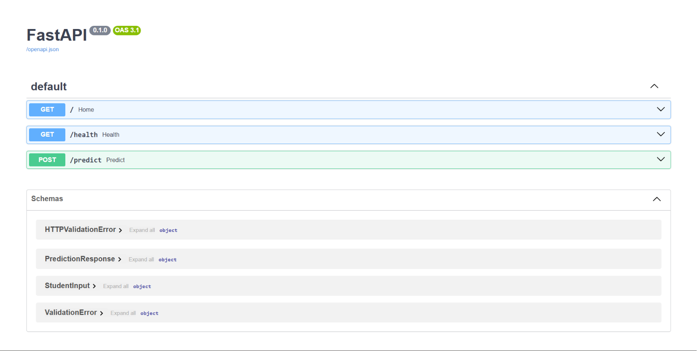
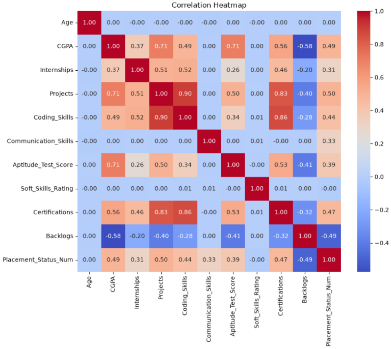

# Student Placement Analytics and Prediction

A machine learning-powered placement prediction system that estimates a student's placement probability based on academic performance, technical skills, certifications, internships, and projects. The project includes a deployed REST API, cloud database integration, Docker containerization, and real-time prediction logging.

---

## Live Demo

### API Endpoint

https://placement-prediction-api-jw00.onrender.com

### Swagger Documentation

https://placement-prediction-api-jw00.onrender.com/docs




---

## Overview

This project predicts whether a student is likely to be placed during campus recruitment using machine learning techniques.

The project evolved from a traditional machine learning workflow into a production-style deployment featuring:

* Machine Learning Model Training
* FastAPI REST API
* Input Validation using Pydantic
* PostgreSQL Prediction Logging
* Docker Containerization
* Cloud Deployment on Render
* Cloud PostgreSQL Database using Neon

---

## Dataset [Kaggle](https://www.kaggle.com/datasets/sonalshinde123/student-placement-dataset)

**Source:** Kaggle Student Placement Dataset

**Size:** 45,000 Records

**Features:** 15 Attributes

**Note:** This dataset is synthetic and generated using predefined logical patterns rather than real-world placement records.

---

## Exploratory Data Analysis

### Strong Positive Indicators

* Aptitude Test Score
* Coding Skills
* Number of Projects

These features showed the strongest positive relationship with placement outcomes.

### Strong Negative Indicator

* Number of Backlogs

Students with higher backlog counts showed significantly lower placement probabilities.

### Minimal Impact Features

* Age
* Gender

These variables demonstrated little influence on placement outcomes.



---

## Data Preprocessing

* Removed `Student_ID`
* Label Encoding for `Gender`
* One-Hot Encoding for `Degree`
* One-Hot Encoding for `Branch`
* Feature Scaling using `StandardScaler`
* Train/Test Split: 80/20

---

## Model Performance

| Model               | Accuracy |
| ------------------- | -------- |
| Logistic Regression | 86.47%   |
| Decision Tree       | 100.00%  |
| Random Forest       | 100.00%  |

---

## Note on Accuracy

The Decision Tree and Random Forest models achieved perfect accuracy because the dataset is synthetic and generated using predefined logical rules.

Feature importance analysis and tree visualization showed that the models effectively learned the exact placement-generation logic embedded within the dataset.

To provide a more realistic benchmark, Logistic Regression was selected for deployment. The model achieved an accuracy of **86.47%**, which better reflects expected performance on real-world placement data.

---

## Deployed ML API

The project includes a production-style FastAPI deployment for real-time inference.

### Features

* FastAPI REST API
* Real-Time Placement Prediction
* Pydantic Request Validation
* Feature Transformation Pipeline
* Logistic Regression Inference
* Probability Score Output
* PostgreSQL Prediction Logging
* Docker Containerization
* Environment Variable Configuration
* Cloud Deployment using Render
* Cloud PostgreSQL Database using Neon

---

## Project Structure

```text
Student_Placement_Analytics_and_Prediction/
│
├── data/
│   ├── train.csv
│   ├── test.csv
│   ├── X_processed.csv
│   └── y_processed.csv
│
├── images/
│   ├── correlation-heatmap.png
│   └── swagger-ui.png
│
├── models/
│   ├── logistic_regression.joblib
│   └── scaler.joblib
│
├── notebooks/
│   ├── data_understanding.ipynb
│   ├── eda.ipynb
│   ├── preprocessing.ipynb
│   └── model_building.ipynb
│
├── main.py
├── database.py
├── Dockerfile
├── docker-compose.yml
├── requirements.txt
├── .env.example
├── .gitignore
└── README.md
```

---

## Tech Stack

### Machine Learning

* Python
* NumPy
* Pandas
* Scikit-learn

### API Development

* FastAPI
* Pydantic
* Uvicorn

### Database

* PostgreSQL
* Neon

### Deployment & DevOps

* Docker
* Docker Compose
* Render
* Git
* GitHub

### Visualization

* Matplotlib
* Seaborn

---

## Local Setup

### Clone Repository

```bash
git clone https://github.com/VineethNaik14/Student_Placement_Analytics_and_Prediction.git
cd Student_Placement_Analytics_and_Prediction
```

### Create Virtual Environment

```bash
conda create -n placement_pred python=3.12
conda activate placement_pred
```

### Install Dependencies

```bash
pip install -r requirements.txt
```

### Configure Environment Variables

Create a `.env` file:

```env
DB_HOST=localhost
DB_NAME=placement_db
DB_USER=postgres
DB_PASSWORD=your_password
DB_PORT=5432
```

### Run FastAPI Locally

```bash
uvicorn main:app --reload
```

Open:

```text
http://localhost:8000/docs
```

---

## Docker Setup

Build and run using Docker Compose:

```bash
docker compose up
```

The API will be available at:

```text
http://localhost:8000/docs
```

---

## API Usage

### Health Check

```http
GET /health
```

Response:

```json
{
  "status": "Running"
}
```

### Placement Prediction

```http
POST /predict
```

Example Request:

```json
{
  "age": 21,
  "gender": "Male",
  "cgpa": 8.5,
  "internships": 2,
  "projects": 4,
  "coding_skills": 8,
  "communication_skills": 8,
  "aptitude_test_score": 85,
  "soft_skills_rating": 8,
  "certifications": 2,
  "backlogs": 0,
  "degree": "B.Tech",
  "branch": "CSE"
}
```

Example Response:

```json
{
  "prediction": "Placed",
  "placement_probability": 0.9124
}
```

---

## Prediction Logging

Every prediction request is stored in a PostgreSQL database with:

* Prediction Result
* Probability Score
* Complete Input Payload
* Timestamp

This enables future auditing, monitoring, and analytics.

---

## Author

**Vineeth Naik**

---

If you found this project useful, consider giving it a ⭐.